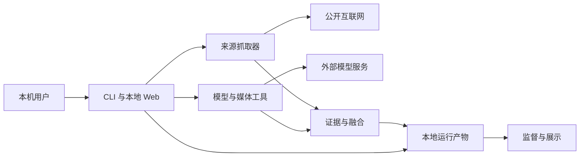

# skill_seargen 威胁模型

## Executive summary

当前按“本地单用户、Web 默认仅监听回环地址”建模。最高风险集中在不可信外部内容跨入模型与工具链、Web 误绑定到非回环地址后缺少鉴权，以及访问外部网页时的 SSRF。网页抓取已新增公网地址与重定向校验；其余边界仍依赖本地部署、人工选源、预算和发布门，不能视为完整沙箱。

## Scope and assumptions

- 范围：`src/skill_gather/` 运行时、`scripts/` 启动入口、两个前端及相关测试与监督协议。
- 假设：单机单用户，`skill-gather web` 使用默认 `127.0.0.1`；公开网页、视频和仓库内容均不可信。
- 敏感资产：API key、GitHub token、本机文件、run、证据、课程、Skill 与评分。
- 当前 Web 无鉴权和租户隔离，安全性依赖回环绑定和可信本机用户。
- 范围外：第三方服务内部实现、`third_party/**`、操作系统/容器逃逸、正式公网多租户部署。
- 开放问题：若未来部署到团队内网或公网，TM-002、TM-004、TM-005 应升至 critical；若 Agent 获得任意 shell 或发布权限，需另建命令执行与供应链发布模型。

## System model

### Primary components

- CLI 与本地 Web：解析参数和 JSON，启动视频/主题任务。证据：`src/skill_gather/cli.py::build_parser`、`src/skill_gather/web.py::_handler_for`。
- 来源抓取：读取网页、GitHub 和 Bilibili。证据：`src/skill_gather/web_text.py::fetch_public_page`、`src/skill_gather/github_processing.py::fetch_public_github_repository`。
- 模型与媒体工具：调用 NewAPI、`yt-dlp`、FFmpeg、faster-whisper。证据：`src/skill_gather/integrations/`。
- 持久化与生成：写入状态、证据、课程和 Skill。证据：`src/skill_gather/runs.py`、`topics.py`、`pipeline/topic_fusion.py`。
- 监督与展示：登记 Trace、截图并脱敏。证据：`src/skill_gather/capture.py`。

### Data flows and trust boundaries

- 浏览器 -> 本地 Web：HTTP JSON、URL、主题、候选 ID、API key；请求体限 64 KiB，无鉴权、Origin 校验或 CSRF token。
- CLI/Web -> 外部来源：HTTP(S) 拉取公开内容；网页入口现校验初始地址、DNS、重定向和最终地址。
- 外部内容 -> 融合/模型：文本、转写和视觉描述进入证据与提示；人工选源、引用、评分和发布门是完整性控制，但不是提示注入沙箱。
- 本地进程 -> 模型/工具：环境变量中的 key 作为 Bearer token；媒体工具用参数列表启动子进程并脱敏错误。
- 进程 -> 本地文件：状态与产物写入配置根目录；删除、下载和捕获路径包含 `resolve`/`relative_to` 检查。

#### Diagram

## Assets and security objectives

| Asset | Why it matters | Security objective (C/I/A) |
|---|---|---|
| API key 与 GitHub token | 泄露后可产生费用或被冒用 | C/I |
| run、课程、Skill 与评分 | 决定结论和发布资格 | I/A |
| 本机文件与网络能力 | SSRF、越界或工具滥用会扩大影响 | C/I/A |
| 来源、引用和审计 | 用于证明结论和拒绝伪通过 | I/A |
| Web 与模型处理能力 | 无界任务可耗尽资源和额度 | A |

## Attacker model

### Capabilities

- 控制已选网页、仓库或视频中的内容与元数据，尝试间接提示注入。
- 服务误绑定到非回环地址时，向无鉴权 API 发请求。
- 提交格式合法但恶意的 URL、主题、候选 ID 和任务参数。
- 诱导操作员选择低可信来源或批准外部副作用。

### Non-capabilities

- 默认部署下，远程攻击者不能直接连接 `127.0.0.1:8766`。
- 不假设攻击者已有本机账户、配置写权限或任意 shell；具备这些权限时当前本地信任边界已失效。
- GitHub 来源只作为文本读取，主题流程不会自动执行仓库代码。

## Entry points and attack surfaces

| Surface | How reached | Trust boundary | Notes | Evidence (repo path / symbol) |
|---|---|---|---|---|
| Web JSON API | HTTP GET/POST/DELETE | 浏览器 -> 进程 | 64 KiB 上限；无鉴权和 Origin 校验 | `src/skill_gather/web.py::_handler_for` |
| CLI/配置 | 终端 | 操作员 -> 进程 | 可指定 URL、目录、监听地址、配置 | `src/skill_gather/cli.py::build_parser` |
| 公开网页 | 已选 URL | 互联网 -> 抓取器 | 拒绝本机、私网、非公网 DNS 和私网重定向 | `src/skill_gather/web_text.py::_assert_public_network_url` |
| GitHub | 仓库 URL | 互联网 -> 抓取器 | 主机限制为 GitHub，token 来自环境变量 | `src/skill_gather/github_processing.py` |
| 模型 API | 证据与提示 | 进程 -> 外部服务 | Bearer token；响应保留结构化审计摘要 | `src/skill_gather/integrations/newapi.py` |
| 媒体子进程 | 视频任务 | 进程 -> 本机工具 | 参数列表、超时和输出脱敏 | `src/skill_gather/integrations/yt_dlp.py`、`ffmpeg.py` |
| 产物读写/删除 | API/CLI | 逻辑 -> 文件系统 | 根目录约束；删除无身份确认 | `src/skill_gather/runs.py::RunStore.delete_run` |

## Top abuse paths

1. 恶意网页写入“忽略策略并泄露环境变量” -> 内容进入模型 -> 污染 Skill 或生成越权建议 -> 操作员误执行。
2. Web 绑定 `0.0.0.0` -> 局域网攻击者调用无鉴权写/删接口 -> 删除 run 或启动高成本任务。
3. 恶意来源提交内网/元数据 URL -> 抓取器访问内部服务 -> 泄露数据；当前由公网和重定向校验拦截，仍有 DNS 重绑定残余风险。
4. 浏览器提交 API key -> key 写入全局环境 -> 并发任务共享进程凭据 -> 凭据串用或泄露面扩大。
5. 批量视频/模型任务 -> 线程、子进程和调用持续占用资源 -> 本地服务、磁盘或额度耗尽。
6. 恶意网页对回环服务发跨站请求 -> 无 Origin/CSRF 校验的接口接受操作 -> 触发任务或删除。

## Threat model table

| Threat ID | Threat source | Prerequisites | Threat action | Impact | Impacted assets | Existing controls (evidence) | Gaps | Recommended mitigations | Detection ideas | Likelihood | Impact severity | Priority |
|---|---|---|---|---|---|---|---|---|---|---|---|---|
| TM-001 | 恶意网页 | 用户选中 URL | SSRF 到本机/私网/元数据 | 读取内部数据 | 网络、凭据 | 初始/最终 URL、DNS 和每次重定向检查；2 MiB 上限 | DNS 预检与连接间有重绑定窗口 | 固定已校验 IP，并在连接层再验证；出口禁私网 | 记录脱敏 URL、解析 IP、重定向和拒绝原因 | low | high | medium |
| TM-002 | 远程调用者 | Web 非回环暴露 | 无鉴权操作创建、处理、删除、模型接口 | 删除产物、耗费额度、使用进程凭据 | run、key、可用性 | 默认 `127.0.0.1`；删除路径有根约束 | 无 auth、Origin、CSRF、非回环警告 | 非回环默认拒绝；显式启用会话令牌、Origin allowlist 和 TLS | 记录来源 IP、路由、状态、操作 ID | low under assumption | high | high |
| TM-003 | 恶意来源作者 | 内容进入模型 | 间接提示注入改变生成/评分/工具建议 | 污染课程或 Skill | 产物、审计 | 人工选源、引用、风险标记、评分和发布门 | 无统一数据/指令隔离、工具 allowlist、tripwire | 外部文本走结构化数据通道；模型默认无工具；高风险命令人工批 | 记录策略版本、来源片段映射和拒绝原因 | medium | high | high |
| TM-004 | 本机页面/并发任务 | Web 输入 key | key 写入 `os.environ` 被同进程任务复用 | 凭据串用或泄露 | key、费用 | key 默认按环境变量名读取；错误输出脱敏 | 进程全局可变状态，无任务级生命周期 | key 仅驻留任务对象并显式传递；任务结束清理 | 只记录 key 标识哈希，检测任务间身份变化 | medium | high | high |
| TM-005 | 未授权 API 调用者 | 可访问 Web | 调用 DELETE 或状态转换 | 破坏/归档证据 | run、审计 | `safe_slug` 和 `relative_to`；活动任务不可删 | 无鉴权、确认 nonce、不可变审计 | 加会话认证；删除改可恢复归档并二次确认 | 记录操作者、run_id、前后状态 | low under assumption | medium | medium |
| TM-006 | 恶意媒体 | 用户选中视频 | 触发高资源解析或工具缺陷 | 本地拒绝服务 | 可用性、本机 | 参数列表、超时、预算和错误脱敏 | 无 OS 级 CPU/内存/PID/磁盘限制 | 独立临时目录、非 root、只读根、无默认网络、资源配额 | 记录峰值资源、超时、退出码、产物大小 | medium | medium | medium |
| TM-007 | 恶意/误操作用户 | 可批量建任务 | 耗尽线程、网络、模型额度 | 不可用或费用增加 | 可用性、预算 | 主题预算、64 KiB 请求体、抓取超时 | 无全局并发/速率上限 | 全局队列、并发上限、速率限制、硬费用阈值 | 队列深度、并发、每日调用/费用 | medium | medium | medium |
| TM-008 | 供应链 | 依赖/工具被替换 | 运行恶意或错误版本 | 本机执行、结果不可复现 | 开发机、构建 | 依赖文件和第三方登记规则；证据仓库不执行 | 外部 CLI/模型版本未全部固定 | 固定版本/哈希、SBOM、CI 最小权限、来源固定 SHA | 记录版本、二进制路径/哈希、lockfile 漂移 | low | high | medium |

## Criticality calibration

- Critical：默认部署即可远程代码执行、读取 key/本机敏感文件，或绕过发布门自动发布恶意 Skill；本轮未确认。
- High：误暴露后无鉴权操作、跨任务凭据串用、间接注入稳定污染高影响产物；对应 TM-002/003/004。
- Medium：需用户先选择恶意来源，或主要造成可恢复的数据/资源损失；对应 TM-001/005/006/007/008。
- Low：仅影响单个可重建临时产物或泄露低敏感元数据；本轮没有主要风险归入此级。

## Focus paths for security review

| Path | Why it matters | Related Threat IDs |
|---|---|---|
| `src/skill_gather/web.py` | API、凭据、后台线程和破坏性操作入口 | TM-002, TM-004, TM-005, TM-007 |
| `src/skill_gather/web_text.py` | DNS、重定向和 SSRF 边界 | TM-001 |
| `src/skill_gather/github_processing.py` | token 与远程内容抓取 | TM-003, TM-004 |
| `src/skill_gather/integrations/newapi.py` | 提示、Bearer token、响应审计 | TM-003, TM-004 |
| `src/skill_gather/pipeline/topic_fusion.py` | 不可信证据进入结论 | TM-003 |
| `src/skill_gather/distillers/technical_skill.py` | 生成命令与发布评分 | TM-003 |
| `src/skill_gather/integrations/yt_dlp.py` | 外部媒体工具调用 | TM-006, TM-008 |
| `src/skill_gather/integrations/ffmpeg.py` | 高资源子进程 | TM-006, TM-007 |
| `src/skill_gather/runs.py` | 状态写入和递归删除 | TM-005 |
| `src/skill_gather/capture.py` | Trace 路径和敏感信息脱敏 | TM-003, TM-004 |
| `scripts/start-web2.ps1` | 8766 监听与启动边界 | TM-002 |
| `package.json`、`pyproject.toml` | 依赖供应链 | TM-008 |

## Quality check

- [x] 覆盖 CLI、Web、来源、模型、子进程、文件与展示入口。
- [x] 每条主要信任边界至少映射到一项威胁。
- [x] 区分运行时风险与构建/开发供应链风险。
- [x] 明确采用本地单用户假设；团队内网/公网排序是条件性的。
- [x] 外部官方来源因当前网络失败保持 `needs_review`，未虚构版本、SHA、热度或漏洞数量。
