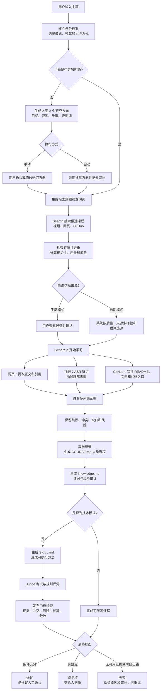

# skill_seargen 前端用户使用指南

本指南面向第一次使用 `skill_seargen` 的体验者。你不需要了解代码，也可以通过浏览器完成 Skill 浏览、主题研究、视频处理和结果查看。

## 1. 这个产品能做什么

`skill_seargen` 会从公开视频、公开网页和 GitHub 仓库中寻找资料，理解其中的文字、语音、画面与代码，再生成一份人能直接学习的课程；技术模式还会生成 AI 可执行的 Skill。来源可信度、冲突和风险另存为审核材料。

可以把主要流程理解为：

```text
Search（寻找并选择资料）
  -> Generate（理解和融合资料）
  -> Judge（评分并标记风险）
```

系统给出的结果仍然需要人检查。页面显示“通过”表示结果值得进一步确认，不代表内容可以不经审核直接发布。

### 输入一个主题后，系统内部发生了什么

例如你输入：

```text
用 HTML Canvas 制作一个躲避障碍小游戏
```

系统不会马上写答案，而是完成下面这条流水线：



用“AI 上大学”的说法，可以把它记成三个阶段：

| 阶段 | 大学类比 | 系统实际做的事 | 你能看到什么 |
|---|---|---|---|
| Search | 选课 | 理解研究目标，从视频、网页和 GitHub 中寻找、去重和评价候选资料 | 研究计划、候选卡片、质量分、风险和推荐理由 |
| Generate | 学习 | 听视频、看画面、读网页和代码，把证据重构为课程，并在技术模式下形成 AI 可执行方法 | 面向人的 `COURSE.md`、审核用 `knowledge.md`、技术模式的 `SKILL.md` |
| Judge | 考试 | 用规则和模型检查证据、结构、可执行性与风险，再经过发布门槛 | 规则分、Judge 分、冲突、证据缺口、风险，以及通过/待复核/失败状态 |

#### 每一步具体在判断什么

1. **建立任务档案**：保存主题、普通或技术模式、手动或自动执行、候选数量、来源数量、运行时间和模型调用预算。页面刷新后仍可重新找到这个任务。
2. **理解主题**：明确主题直接进入搜索；“教程”“游戏”这类宽泛主题会先生成多个研究方向，避免系统搜到一堆彼此无关的材料。
3. **搜索候选**：普通模式主要寻找网页和视频；技术模式会额外寻找 GitHub 仓库。搜索结果会经过来源检查、去重、相关性判断、质量评分和风险标记。
4. **确认选课**：手动模式由你决定学习哪些来源；自动模式按质量、来源类型多样性和预算选择，并保存自动选源记录。确认之前不会启动下载、ASR 或模型生成等高成本操作。
5. **分来源学习**：网页被提取为正文和引用；视频被转写并按设置分析画面；技术模式下的 GitHub 来源会读取 README、文档、示例、配置和代码入口。某一条来源失败时，其他成功来源仍可继续处理。
6. **融合知识**：系统不会简单拼接摘要，而是记录哪些来源支持同一结论、哪些说法冲突、哪些问题缺少证据，以及来源本身的可信度和风险。
7. **生成课程**：所有主题都会形成 `COURSE.md`，包括学习目标、课程导览、教学单元、误区、自测和实践。技术模式还会生成候选 `SKILL.md`，描述 AI 的适用场景、前提、步骤、限制和引用。`knowledge.md` 专门保留证据、冲突和可信度审计。
8. **考试和毕业审核**：技术结果由规则和 Judge 评分。发布门槛还会检查是否有至少两个交叉来源、是否存在冲突或证据缺口、是否有风险、预算是否超限，以及分数是否达到门槛。
9. **给出状态**：条件充分时显示“通过”；有价值但证据不足时显示“待复核”；没有提取到可用证据或关键阶段失败时显示“失败”。系统会保留失败原因和已完成产物，便于恢复或重试。

最需要记住的是：

```text
“已完成”表示流水线跑完了，
“通过”才表示达到了当前质量门槛，
而“通过”仍然不代替人的最终复核。
```

## 2. 启动产品

在项目目录打开 PowerShell，运行：

```powershell
.\scripts\dev.cmd
```

看到服务地址后，在浏览器打开：

```text
http://127.0.0.1:8765
```

如果页面打不开，请确认启动窗口没有关闭，并检查端口是否被其他程序占用。

## 3. 第一次体验：不需要 API Key

如果你只是想了解产品，推荐先走离线体验流程：

1. 打开顶部的“工作台”。
2. 切换到“研究”。
3. 在“主题搜索”中输入一个明确主题，例如“浏览器小游戏的碰撞检测”。
4. 模式选择“技术模式”。
5. 执行模式选择“手动确认”。
6. 勾选“离线 fake”。
7. 点击“创建主题”，再点击右侧的“搜索候选”。
8. 勾选候选资料并点击“确认选择”。

离线 fake 用于体验页面、任务状态和选源流程。它使用演示数据，不代表系统已经访问了真实网页、B 站、GitHub 或 AI 模型，也不能把生成结果作为真实研究结论。

## 4. 首页

首页介绍产品的两条核心能力：

- **Search**：发现公开视频、网页和代码来源。
- **Generate**：把多模态证据蒸馏成人类课程，并在技术模式下形成 AI Skill。

首页下方会展示部分精选 Skill。点击卡片可以直接查看详情。

## 5. 浏览 Skills

点击顶部“浏览 Skills”进入目录。

你可以使用以下筛选项：

- **搜索**：按名称、用途、标签或来源搜索。
- **分类**：只查看某一类 Skill。
- **状态**：区分“可下载”和“来源索引”。

打开 Skill 后，请重点查看：

- **适合谁**：判断它是否符合你的任务。
- **使用前提**：确认本机环境和输入材料是否满足要求。
- **证据**：查看该 Skill 为什么被收录。
- **风险**：了解使用限制和需要人工确认的部分。
- **来源、版本、许可证**：确认是否允许下载、使用或再分发。

### 状态说明

| 页面状态 | 含义 |
|---|---|
| 可下载 | 本地演示包已通过当前再分发检查，可以下载 ZIP |
| 来源索引 | 页面只提供原始来源链接，不在本站保存副本 |
| 待复核索引 | 来源、版本或许可证还需要确认，不能当作已验证内容 |

## 6. 工作台概览

工作台分为三个页面：

| 页面 | 主要用途 |
|---|---|
| 运营 | 查看任务数量、运行状态、耗时，以及暂停或重试任务 |
| 研究 | 创建主题研究或提交单个 B 站公开视频 |
| 结果 | 阅读、筛选、比较和导出已经生成的结果 |

右上角“运行自检”用于检查本地原型的基本链路。自检通过不等于真实网络、真实视频和真实模型均可用。

## 7. 创建主题研究

进入“工作台 -> 研究”，在“主题搜索”区域创建任务。

### 7.1 填写主题

主题越明确，搜索结果越容易使用。

推荐：

```text
用 HTML Canvas 制作躲避障碍小游戏的方法
```

不推荐：

```text
教程
AI
游戏
```

如果主题过于模糊，系统会显示多个研究语义。请选择最符合目标的一项，也可以修改目标、排除范围、研究维度和查询词，然后点击“确认计划”。

### 7.2 选择模式

| 模式 | 适用场景 | 主要结果 |
|---|---|---|
| 普通模式 | 了解一个话题、学习教程或建立知识结构 | `COURSE.md` 人类课程 + `knowledge.md` 审计附录 |
| 技术模式 | 学习工具、开发流程、代码实践或生成可执行方法 | `COURSE.md` 人类课程 + `SKILL.md` AI 能力 + 审计和评分 |

技术模式会额外考虑 GitHub 来源，但并不保证每次都能找到合适的公开仓库。

### 7.3 选择执行模式

| 执行模式 | 行为 | 推荐人群 |
|---|---|---|
| 手动确认 | 由你检查候选资料并决定哪些资料进入处理 | 第一次使用、正式研究或需要控制来源时 |
| 自动执行 | 系统在预算和质量规则内自动搜索、选源和处理 | 已熟悉产品、用于演示或批量试验时 |

自动执行不等于自动发布。证据不足、存在冲突、风险或低分时，结果仍会标记为“待复核”或“失败”。

### 7.4 选择候选来源

每张候选卡会显示来源类型、站点、摘要、相关原因、风险和质量分。

选源时建议：

- 优先选择与主题直接相关的来源。
- 尽量选择网页、视频、GitHub 等不同类型的资料交叉验证。
- 不要只看质量分，还要阅读风险标记和摘要。
- 不要选择需要登录、付费、cookie 或绕过验证码才能访问的来源。
- 正式任务建议选择两条以上独立来源。

完成选择后点击“确认选择”。确认后，系统才会进入网页读取、视频处理、ASR、视觉分析和知识生成等高成本阶段。

### 7.5 开始处理

手动模式下，确认来源后可以设置：

- **视觉模式 - 关闭**：不分析视频画面，速度快，但可能遗漏演示内容。
- **视觉模式 - 抽样**：分析少量关键帧，适合大多数体验任务。
- **视觉模式 - 全量**：分析更多画面，耗时和模型调用成本更高。
- **视觉帧数**：限制抽样模式下分析的画面数量，默认 12。

设置完成后，点击“开始处理已选来源”。处理期间不要重复提交同一操作。

## 8. 处理单个 B 站公开视频

在“工作台 -> 研究”的“从视频提炼可复核 Skill”区域，可以直接提交一个 B 站公开视频。

操作步骤：

1. 如需使用远程文本、视觉或 Judge 模型，填写 NewAPI API Key。
2. 点击“查询模型”确认当前服务返回了可用候选。
3. 选择 Judge 难度。
4. 选择手动或自动执行模式。
5. 粘贴可公开访问的 B 站视频 URL。
6. 点击“开始处理”。

API Key 只会写入当前 Web 服务进程的环境变量，不会写回配置文件，也不会在页面响应中回显。关闭服务后需要重新提供。不要使用他人的 Key，也不要把 Key 放进截图、演示文档或 Git 仓库。

本产品不支持会员、付费、登录、地区限制、验证码绕过或需要 cookie 的视频。

### Judge 难度

| 难度 | 适用情况 |
|---|---|
| 宽松 | 早期探索，允许更多结果进入人工复核 |
| 标准 | 默认选择，平衡结果数量和质量要求 |
| 严格 | 对证据、结构和可执行性要求较高的任务 |
| 关闭 Judge | 跳过 LLM Judge；结果会保守标记为待复核 |

## 9. 查看任务状态

### 运营页

“运营”页会显示：

- 任务总数和活动作业数；
- 模型可用性；
- 当前阶段、耗时和失败原因；
- 可用时的“暂停”或“重试”按钮。

暂停通常会在当前来源或处理阶段的安全边界生效，不一定在点击后立即停止。

### 研究页

左侧列表保存主题任务和视频处理记录。点击一条记录，可以在右侧查看：

- 当前状态和处理阶段；
- 已选来源与视频子任务；
- 规则评分和 Judge 评分；
- 证据摘要、冲突、缺口和风险；
- 失败原因及可用的恢复操作。

常见状态：

| 状态 | 含义 |
|---|---|
| 排队中 / 未搜索 | 任务已创建，尚未开始 |
| 待语义确认 | 主题太模糊，需要确认研究方向 |
| 待确认 | 已找到候选来源，等待用户选择 |
| 处理中 / 生成中 / 评分中 | 系统正在学习资料并检查结果 |
| 已暂停 | 任务被用户暂停，可以稍后重试 |
| 已完成 | 流程完成，请继续检查评分和风险 |
| 待复核 | 结果存在证据、冲突、风险或评分问题，需要人工判断 |
| 失败 | 流程未完成，请阅读失败原因后重试 |

## 10. 阅读和导出结果

进入“工作台 -> 结果”。

你可以按以下条件筛选：

- 结果类型：视频、主题或 Skill；
- 状态：通过、待复核或失败；
- 最低评分；
- 风险标记；
- 来源。

点击结果标题后会先看到“人类课程”。技术主题在课程下方继续显示“AI Skill”；证据冲突、可信度和风险保留在审核产物与评分中。

需要比较时，勾选 2 至 3 个结果并点击“比较所选”。比较适合检查不同来源、不同参数或不同 Judge 难度造成的差异。

需要保存时，勾选结果并点击“导出所选”。浏览器会下载 `skill-seargen-results.json`，其中可能包含结果正文和审计信息。导出前请检查是否适合对外分享。

## 11. 如何判断一个结果能不能用

不要只看总分。至少检查：

1. 来源是否真实、可访问，并与结论直接相关。
2. 是否有两条以上独立来源互相支持。
3. 页面是否显示证据冲突或证据缺口。
4. 风险标记是否影响你的实际用途。
5. `COURSE.md` 是否真正可学，技术模式的 `SKILL.md` 是否可执行；不要把 `knowledge.md` 的可信度清单误当成课程正文。
6. 许可证是否允许使用、修改或再分发。
7. 对重要用途，是否已经由了解该领域的人复核。

“通过”只表示结果达到当前自动门槛，仍然需要人工确认；“待复核”不是无效，而是系统无法在现有证据下安全地替你作决定。

## 12. 常见问题

### 搜索不到结果

- 把主题写得更具体。
- 检查是否勾选了离线 fake。
- 真实搜索需要正确配置 SearXNG 等搜索服务。
- 单个来源服务失败时，系统可能仍保留其他来源及 warning。

### 提示未配置 NewAPI API Key

在单视频处理区域填写有效 Key，或在启动服务前通过 `NEWAPI_API_KEY` 环境变量提供。没有 Key 时，依赖远程模型的视觉、生成或 Judge 环节可能无法运行。

### 视频没有视觉分析结果

检查视觉模式是否关闭、是否配置了视觉模型，以及视频子任务中的“视觉”状态和失败原因。只有 ASR 成功不代表画面已经被分析。

### 任务一直处于处理中

在“运营”页刷新指标，查看当前阶段和耗时。视频下载、ASR 和远程模型调用可能需要较长时间。超过预算或遇到外部服务错误时，任务会记录失败原因。

### 为什么结果是待复核

常见原因包括：只有单一来源、来源互相冲突、证据缺口、风险标记、部分来源失败，或评分未达到自动通过门槛。请先阅读结果详情，不要为了得到“通过”而忽略这些问题。

### 刷新页面后任务会丢失吗

已经写入本地 run 的任务可以重新读取。正在执行的后台作业是否继续，取决于 Web 服务进程是否仍在运行；不要在处理过程中关闭启动窗口。

## 13. 演示者推荐路线

现场向客人展示时，可以使用以下 3 至 5 分钟路线：

1. 在首页解释 Search 与 Generate。
2. 在“浏览 Skills”中打开一个可下载 Skill，展示来源、许可证、证据和风险。
3. 进入“工作台 -> 研究”，使用离线 fake 创建一个技术主题。
4. 展示候选来源质量分和人工选源。
5. 打开一个已经预处理完成的真实结果，先展示“人类课程”的学习目标、教学单元和自测。
6. 技术主题继续展示“AI Skill”，最后再说明评分、证据冲突和“待复核”状态。

现场不要临时启动耗时较长的真实视频任务。建议提前准备真实产物和录屏，并明确告诉观众哪些是离线演示数据、哪些是真实链路结果。

## 14. 使用边界

- 只处理公开可访问的资料。
- 不使用 cookie、登录、付费内容或验证码绕过。
- 不把自动评分当作事实证明或发布许可。
- 不在 Git 中提交 API Key、视频、音频、关键帧、运行日志或模型原始输出。
- 外部 Skill 默认只提供来源索引；只有明确允许再分发的本地包才提供下载。
- 涉及生产系统、安全、法律、医疗、财务或其他高风险用途时，必须由专业人员复核。
