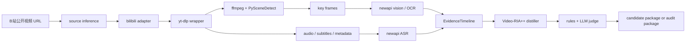

# 视频驱动 Skill Gather 工具 v0.1 立项计划

## 1. 项目摘要

v0.1 目标是做一个**自用可跑通的本地 CLI 原型**：输入单个 B站公开视频 URL，使用现成开源工具完成视频采集、关键帧抽取、画面理解、音频转写、证据链合并、skill 蒸馏、评分和人工复核辅助，并输出标准化候选包：

```text
SKILL.md
README.md
metadata.json
```

核心原则：

- **Fork-first，不自造轮子**：采集、抽帧、场景检测、ASR/OCR、蒸馏模板尽量 fork 或包装已有项目。
- **v0.1 只做 B站主线**：YouTube 暂不实现，只保留后续扩展空间。
- **只处理单个公开视频**：支持单个 BV/av URL；不做合集、批量、会员、付费、验证码、地区限制或绕权内容。
- **视频画面优先理解**：不能依赖字幕；默认使用关键帧视觉理解 + 云端 ASR。
- **只为 skill 服务**：不追求完整复原视频，只提炼可迁移、可执行、可验证的 skill。
- **证据不足明确失败**：不硬凑高分候选；失败时保留审计包。
- **保留证据链**：每条候选 skill 必须能追溯到时间戳、视觉/OCR/ASR 证据、置信度和风险标记。

## 2. 已确认的 v0.1 决策

| 决策点 | v0.1 选择 |
|---|---|
| 主链路 | B站 |
| B站范围 | 单个 BV/av 公共视频 |
| YouTube | v0.1 先不做 |
| 来源识别 | 从 URL 自动推断；推断失败时追问一次 |
| 登录/cookie | 不支持，只处理公开视频 |
| 批量处理 | 单个 URL 为主，批量后补 |
| 产出粒度 | 一个视频默认生成一个 skill 候选 |
| 证据不足 | 明确失败，不生成伪完整 skill |
| 失败产物 | 保留审计包，不生成 `SKILL.md` |
| 单通道证据 | 可生成候选，但最高只能是 `needs_review` |
| 中间产物保留 | 关键帧和中间音频默认手动清理 |
| 断点续跑 | 必须支持，采用阶段级恢复 |
| 云端模型入口 | newapi 多模态入口 |
| 模型配置 | 配置文件必填，不写死模型名 |
| Skill 骨架 | 默认强制 RIA++，少数不适配时允许降级并记录原因 |
| Test 段 | 示例 + 检查表 |
| README | 技能说明，不放完整审计报告 |
| `score` 输出 | 默认 JSON |
| `inspect` 目标 | 面向人工复核 |
| `inspect` 首屏 | 证据摘要 + 评分 |
| 评分策略 | 规则分 + LLM judge 每次都跑 |
| 分数冲突 | 取更保守结果 |
| 通过状态 | `85+` 只标记 `passed`，不自动入库 |
| 复核状态 | `70-84` 生成候选包并标记 `needs_review` |
| 去重策略 | 按来源视频 ID 去重并复用 run |

## 3. 参考与复用策略

### 3.1 直接复用或 fork

| 能力 | 推荐复用对象 | 用法 |
|---|---|---|
| 视频采集 | `yt-dlp` | 获取 B站元数据、字幕候选、媒体流 |
| 媒体处理 | `ffmpeg` | 抽音频、抽帧、降分辨率、切短片段 |
| 场景检测 | `PySceneDetect` | 识别 PPT 翻页、窗口切换、代码画面变化 |
| 视频下载流程参考 | `kangarooking video-downloader` | 借鉴 `yt-dlp + ffmpeg + ASR` 的流程组织 |
| skill 蒸馏 | `kangarooking/cangjie-skill` | 借鉴 RIA-TV++、多 extractor、三重验证、压力测试 |
| 长材料结构化 | `book-to-skill` | 借鉴长内容切块、章节化、渐进披露目录 |
| skill 标准 | Anthropic Skills / Codex skill 结构 | 输出统一 `SKILL.md`、`README.md`、`metadata.json` |
| LLM 评测 | promptfoo 思路 | 借鉴 LLM-as-judge 和 rubric 配置 |

### 3.2 只自研的部分

- B站 source adapter 的薄封装。
- `VideoSourceManifest`、`EvidenceTimeline`、`SkillPackage`、`RunState` 四个统一数据结构。
- Video-RIA++ 编排层。
- 固定评分规则与候选状态门槛。
- 临时缓存、证据链、日志、失败恢复。
- 针对 skill 的最终打包、审计包和人工复核视图。

## 4. 总体架构



### 4.1 B站 source adapter

`bilibili-adapter`：

- 支持单个 BV/av 公共视频。
- 解析标题、UP 主、分区、简介、时长、字幕可用性、来源视频 ID。
- 对分 P/合集只识别风险，不在 v0.1 批量展开处理。
- 不接 cookie，不处理会员、付费、验证码、地区限制或其他访问控制内容。
- 标记风险：无字幕、分 P/合集、接口波动、内容访问限制、媒体不可获取。

### 4.2 共用视频理解管线

- `yt-dlp` 负责获取 metadata、字幕候选、媒体流。
- `ffmpeg` 负责抽音频、低清帧、必要短片段。
- `PySceneDetect` 负责检测场景变化点。
- newapi 视觉模型负责 OCR、代码/命令识别、UI 操作理解、PPT 要点提取。
- newapi ASR 负责口播转写。
- `timeline-merger` 合并视觉、OCR、ASR、字幕和 metadata，形成带时间戳的证据链。

## 5. 关键帧策略

抽帧数量随视频长度变化，而不是固定数量。

| 视频长度 | 基础抽帧间隔 | 默认上限 |
|---|---:|---:|
| 0-10 分钟 | 每 8-12 秒 1 帧 | 80 帧 |
| 10-30 分钟 | 每 15-20 秒 1 帧 | 120 帧 |
| 30-90 分钟 | 每 30-45 秒 1 帧 | 180 帧 |
| 90 分钟以上 | 章节/场景变化优先 | 240 帧 |

补充规则：

- 场景变化补帧：PPT 翻页、IDE 切窗口、终端输出变化、代码滚动明显时补采。
- 低信息帧剔除：纯人脸、片头片尾、重复 PPT、静态封面、无文字空画面降权或删除。
- 每个保留帧必须记录 `timestamp`、`reason`、`visual_type`、`importance`。
- 关键帧和中间音频默认保留到用户手动清理，用于调试和人工复核。

示例：

```json
{
  "video_duration_sec": 3600,
  "frame_budget": 180,
  "sampling_strategy": "adaptive_interval_plus_scene_change",
  "selected_frames": [
    {
      "timestamp": "00:03:12",
      "reason": "code_screen_changed",
      "visual_type": "ide_code",
      "ocr_density": "high",
      "importance": 0.87
    }
  ]
}
```

## 6. Video-RIA++ 蒸馏流程

借鉴 `cangjie-skill`，但把输入从书/文本扩展为 `ASR + OCR + 视觉观察 + 时间戳证据`。

### 6.1 视频总览

使用标题、简介、分区、首批关键帧、ASR 摘要判断视频是否值得蒸馏。

输出：

- 视频主题。
- 目标受众。
- 是否是技术教程、代码演示或工具流程。
- 预计能产出的 skill 类型。
- 风险与低质量原因。

### 6.2 多通道提取

- `ASR extractor`：提取口播里的原则、步骤、判断标准。
- `Frame OCR extractor`：提取代码、命令、配置、PPT 要点。
- `Visual action extractor`：提取 UI 操作、窗口切换、演示流程。
- `Example extractor`：提取案例、反例、坑、调试过程。
- `Toolchain extractor`：提取依赖、版本、环境、命令。

### 6.3 三重验证

- 跨模态一致性：口播、画面、OCR 是否互相支持。
- 可执行性：能不能变成明确步骤，而不是一句观点。
- 迁移性：是不是离开这个视频也能复用。

单通道证据策略：

- 只有 ASR 或只有 OCR 支撑时，允许生成候选。
- 单通道候选最高只能进入 `needs_review`，不能直接 `passed`。
- 如果 ASR/OCR/视觉都无法提供足够证据，则进入失败分支，只保留审计包。

### 6.4 Skill 构造

每个 skill 默认使用 RIA++ 结构：

- `Recall`：原始证据摘要 + 时间戳。
- `Interpret`：抽象原则/判断规则。
- `Apply`：可执行步骤/模板/命令。
- `Boundary`：适用/不适用场景。
- `Test`：示例 + 检查表。

如果某类内容不适合 RIA++ 五段结构，可以降级模板，但必须在 `metadata.json` 中记录降级原因。

### 6.5 Skill 压测

检查 skill 是否：

- 能被明确触发。
- 不胡乱泛化。
- 有明确输出。
- 对不适用任务会拒绝或降级。
- 能从证据链追溯来源。

## 7. CLI 与产物

### 7.1 CLI

```bash
skill-gather video <url> --out ./skills
skill-gather score <skill-dir>
skill-gather inspect <run-id>
```

命令行为：

- `video <url>`：从 URL 自动推断来源；v0.1 只接受 B站公开视频。
- `score <skill-dir>`：默认输出 JSON。
- `inspect <run-id>`：面向人工复核，首屏显示证据摘要、风险、评分和状态。

### 7.2 产物目录

目录名使用“清洗后的视频标题 + 短 hash”，兼顾可读性和去重。

```text
skill-title-a1b2c3/
  SKILL.md
  README.md
  metadata.json
```

文件分工：

- `SKILL.md`：给 Codex/模型使用的技能主体，默认 RIA++ 结构。
- `README.md`：给人看的技能说明，包括用途、适用场景、使用示例和注意事项。
- `metadata.json`：结构化证据、评分、模型配置、风险标记和状态。

### 7.3 失败审计包

证据不足或处理失败时不生成 `SKILL.md`，只保留审计包：

```text
runs/<run-id>/
  manifest.json
  evidence_timeline.json
  frame_index.json
  run_state.json
  failure_report.md
```

审计包至少说明：

- 视频来源与基础元数据。
- 已完成阶段和失败阶段。
- 可用证据与缺失证据。
- 风险标记。
- 是否可重跑，以及建议重跑参数。

## 8. 数据结构

### 8.1 `VideoSourceManifest`

```json
{
  "source": "bilibili",
  "source_id": "BV...",
  "url": "...",
  "title": "...",
  "author": "...",
  "duration_sec": 3600,
  "subtitle_available": false,
  "media_access": "public",
  "risk_flags": ["no_subtitle"]
}
```

### 8.2 `EvidenceTimeline`

```json
{
  "video_duration_sec": 3600,
  "frame_budget": 180,
  "sampling_strategy": "adaptive_interval_plus_scene_change",
  "items": [
    {
      "timestamp": "00:12:33",
      "type": "frame_ocr",
      "claim": "演示了 pnpm create vite 初始化项目",
      "raw_excerpt": "pnpm create vite",
      "confidence": 0.91
    }
  ]
}
```

### 8.3 `RunState`

```json
{
  "run_id": "...",
  "source_id": "BV...",
  "status": "running",
  "current_stage": "ocr",
  "completed_stages": ["manifest", "media_extract", "frame_extract", "asr"],
  "artifacts": {
    "manifest": "runs/.../manifest.json",
    "audio": "runs/.../audio.wav",
    "frame_index": "runs/.../frame_index.json"
  }
}
```

### 8.4 `metadata.json`

```json
{
  "source": "bilibili",
  "source_id": "BV...",
  "source_url": "...",
  "title": "...",
  "author": "...",
  "generated_at": "...",
  "package_status": "needs_review",
  "models": {
    "vision": "configured-vision-model",
    "asr": "configured-asr-model",
    "distiller": "configured-text-model",
    "judge": "configured-judge-model"
  },
  "evidence": [
    {
      "timestamp": "00:12:33",
      "type": "frame_ocr",
      "claim": "演示了 pnpm create vite 初始化项目",
      "confidence": 0.91
    }
  ],
  "risk_flags": ["no_subtitle"],
  "scores": {
    "rule_score": 82,
    "llm_judge_score": 86,
    "final_score": 82,
    "final_status": "needs_review",
    "conflict_policy": "conservative"
  }
}
```

## 9. 配置

模型配置必须显式提供，不写死默认模型名。

示例：

```json
{
  "providers": {
    "newapi": {
      "base_url": "https://api.renice.cc/v1",
      "api_key_env": "NEWAPI_API_KEY",
      "vision_model": "...",
      "asr_model": "...",
      "distiller_model": "...",
      "judge_model": "..."
    }
  },
  "defaults": {
    "provider": "newapi",
    "output_dir": "./skills",
    "run_dir": "./runs"
  }
}
```

## 10. 固定评分规则

总分 100，v0.1 只做候选质量判断，不自动公开发布，不自动入库。

| 维度 | 权重 | 判定要点 |
|---|---:|---|
| 可执行性 | 25 | 是否能变成明确步骤、命令、判断规则 |
| 画面证据质量 | 15 | OCR/视觉观察是否支撑 skill |
| ASR/口播证据质量 | 15 | 口播是否提供关键逻辑和上下文 |
| 可迁移性 | 15 | 是否离开视频仍能复用 |
| 结构规范 | 10 | 是否符合 skill 包格式 |
| 边界清晰度 | 10 | 是否说明适用/不适用场景 |
| 安全与合规风险 | 10 | 是否存在越权、版权、危险指令风险 |

默认门槛：

- `85+`：`passed`，高质量候选，但不自动入库。
- `70-84`：`needs_review`，生成候选包，等待人工复核。
- `<70`：`failed`，不建议入库。

评分策略：

- 规则分和 LLM judge 每次都跑。
- 如果规则分和 LLM judge 冲突，最终状态取更保守结果。
- 单通道证据候选最高只能是 `needs_review`。

## 11. 断点续跑与去重

必须支持阶段级断点续跑。

阶段状态至少包括：

- `manifest`
- `media_extract`
- `frame_extract`
- `asr`
- `vision_ocr`
- `timeline_merge`
- `distill`
- `score`
- `package`

去重策略：

- 同一个来源视频 ID 默认视为同一任务。
- 重复提交同一视频时复用已有 run 和中间结果。
- 如果用户需要重新跑，应由后续参数显式触发。

## 12. v0.1 验收标准

测试样本：

- 3 个 B站无字幕技术教程视频。
- 2 个 B站有字幕技术教程视频。
- 至少 1 个超过 60 分钟的 B站视频。
- 至少 1 个证据不足或不可处理的视频，用于验证失败审计包。

通过标准：

- 每个可处理样本都能生成完整 `EvidenceTimeline`。
- 无字幕 B站视频能靠关键帧 + ASR 产出可理解候选。
- 抽帧数量随视频长度变化，并记录采样原因。
- 证据不足时明确失败，不生成伪完整 `SKILL.md`。
- `70-84` 样本生成候选包并标记 `needs_review`。
- `85+` 样本标记 `passed`，但不自动入库。
- `score` 默认输出 JSON。
- `inspect` 首屏展示证据摘要、风险、评分和状态。
- 中断后重跑能从已完成阶段恢复。
- 至少 60% 可处理样本经人工检查后可复用。
- git 操作如因网络失败中断，必须通知用户并保留进度说明。

## 13. 假设与边界

- v0.1 是自用原型，不做公开发布级安装体验。
- 默认使用 newapi 提供云端视觉、ASR、文本蒸馏和 LLM judge。
- 用户自备 API key，模型名必须在配置文件里显式填写。
- 不绕过平台权限、付费内容、验证码、地区限制或访问控制。
- 不长期承诺保存原始大视频；关键帧和中间音频默认由用户手动清理。
- fork 第三方库前必须记录 license；许可证不清楚的项目只能参考，不能直接合并发布。
- 项目核心不是“下载视频”，而是从视频证据中蒸馏可迁移、可执行、可验证的 skill。

## 14. v0.1 之后的演进

- P1：增加 YouTube adapter。
- P1：增加批量 URL 处理。
- P1：增加 cookie 支持，但仍不绕权、不处理付费和验证码内容。
- P1：增加本地 OCR / 本地 ASR 作为降成本模式。
- P1：补安装说明、错误提示、成本提示、复核报告。
- P2：增加 GitHub skill gather 入口，统一视频来源与代码仓库来源。
- P2：做公开发布级合规声明、权限确认、日志脱敏和插件化扩展。
- P2：建立 skill benchmark dataset，校准 LLM judge 和固定评分规则。
